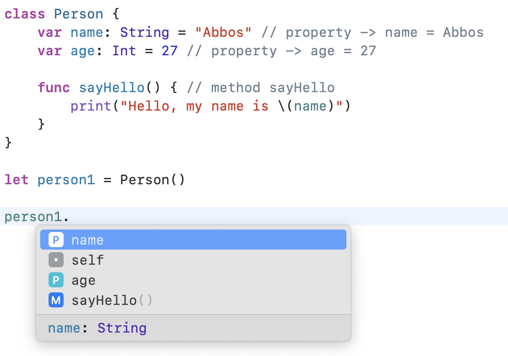

# Class and struct

## Class

A class is a blueprint for creating objects in programming. It defines the properties and methods that an object will have, and objects created from a class are stored in the computer's memory and can be shared between different parts of a program.

`Class` - bu dasturlashda ob'ektlarni yaratish rejasi. Class property va methodlardan iborat nomga ega bo'lgan kod bloki. Va `class` car yaratilinayotgan dasturning turli qisimlarida ishatishga mo'ljallangan.


`property` - class yoki struct ga tegishli bo'lgan o'zgaruvchi yoki o'zgarmas kattalik

`method` - class yoki struct ga tegishli funksia


Quida `Person` deb nomlangan class yaratish tartibini ko'rishingiz mumkin

```swift
class Person {
    var name: String = "Abbos" // property -> name = Abbos
    var age: Int = 27 // property -> age = 27
    
    func sayHello() { // method sayHello
        print("Hello, my name is \(name)")
    }
}
```

`Person` degan class yaratilindi va unga `name`, `age` deb nomlangan propertylar va `sayHello` deb nomlangan method lar yozildi.

`init` - bu yerda `construct` (ya'ni quruvchi) vazifasidagi class yoki struct ichida keladigan `swift` dasturlash tiliga xos xususiyatidir.


`constructor` - quruvchi, class yoki struct ning birorta obyekti yaratish jarayonida ishga tushadigan `method`.


```swift
// Person degan class dan foydalanish jarayoni

let person1 = Person()
print(person1)

// natija: __lldb_expr_1.Person
```

Yuqorida biz `person1` nomli `Person` clasiga tegishli obyekt yaratdik. `print` orqali `person1` ni konsolga chiqarmoqchi bo'lganimizda noaniq ma'lumot paydo bo'ldi. Bu qo'rqinchli emas va bu oddiygina classni swift uchun tushunarli ko'rinishi.

Xo'sh unda biz qanday qilib class (Person) ichidagi ma'lumot larni olib chiqamiz.

```swift
// Juda ham oddiy
print(person1.name)
// Abbos
```

Ko'rib turganingizdek, `class` obyektidan keyin `.` ni qo'yish orqali unga tegishli methodlarni yoki propertylarni ko'rish mumkin.

<figure><figcaption><p>Get class properties and methods</p></figcaption></figure>

### Struct

`struct` ham class kabidir. Faqat bir qancha farqlarga ega.

Keling avval ularni o'xshash jixatlariga to'xtalsak

> `Property`lar: class va struct o'zining propertylariga ega
>
> `Method`lar: class va struct da methodlar yaratish va ularni ishlatish mumkin
>
> `Initializer`: `class` va `struct` init methodi mavjud
>
> `Subscript`lar: `class` uchun ham `struct` uchun ham `subscript` yozsa bo'ladi
>
> `Extension`lar: `class` uchun ham `struct` uchun ham `extension` yozsa bo'ladi

Xo'sh unda ularni farqi qayerlada ko'rinadi desangiz

> `Type`: `struct`lar `value type` xisbolanadi. `class` esa `reference type`
>
> `Inheritance`: `Struct`lardan nasl olinmaydi, lekin `class` dan olsa bo'ladi.
>
> `Deinitializers`: `class` ichida `deinit` methodini o'zgartirsa bo'ladi, lekin structda buni iloji yo'q


`value type` - ya'ni agar bir struct object boshqa bir struct objectga tenglashtirilsa uning qiymatlari `copy` bo'ladi ya'ni nusxalanadi. Bu degani ikkinchi struct object ichidagi birorta property o'zgartirilsa ham birnichi objectda hech nima bo'lmaydi

`reference type` - bunda class object boshqa bir class objectga tenglashtirilsa brinchi class object ikkinchiga `copy` qilinmaydi aksincha uni o'zi ikkinchi objectga aylanib qoladi. yoki buni bir object bir vaqtni o'zida ikkita joyda turipdi deb tushunsa bo'ladi


Masalan

```swift
// value type object uchun misol

struct Person {
    var name: String
    var age: Int
}

var person1 = Person(name: "John", age: 30)
var person2 = person1

print(person1.name) // Output: John
print(person2.name) // Output: John

person2.name = "Jane"

print(person1.name) // Output: John
print(person2.name) // Output: Jane
```

Yuqoridagi kodimizda `Person` nomli bir struct yaratdik va unga `name` va `age` degan propertylarini qo'shdimiz. Keyin esa `person1` nomli `Person` tipidagi obyekt yaratdik va `name` va `age` ning qiymatlarini "John" va 30 ga tenglashtirdik. Deyarli birinchi o'zgaruvchi e'lon qilgan holda uning nusxasini olamiz va `person2` degan o'zgaruvchiga tenglaymiz. Bu erda, `person1` va `person2` o'zgaruvchilari bir xil qiymatlarga ega.

Keyin `person2` ning `name` qiymatini "Jane" ga o'zgartiramiz va natijada `person1`ning `name` qiymati o'zgarmaydi, chunki `Person` structlar value type ga misoldir. Demak, `person2` yaratilgan paytda `person1` ning nusxasi olinib `person2`ga tenglandi. Shuningdek, `Person` structlari value type olduğundan, obyektga referensiya yaratilmaydi.

```swift
class Person {
    var name: String
    var age: Int
    
    init(name: String, age: Int) {
        self.name = name
        self.age = age
    }
}

var person1 = Person(name: "John", age: 30)
var person2 = person1

print(person1.name) // Output: John
print(person2.name) // Output: John

person2.name = "Jane"

print(person1.name) // Output: Jane
print(person2.name) // Output: Jane
```

Yuqoridagi kodimizda `Person` nomli bir class yaratdik va unga `name` va `age` degan propertylarini qo'shdimiz. Keyin esa `person1` nomli `Person` tipidagi obyekt yaratdik va `name` va `age` ning qiymatlarini "John" va 30 ga tenglashtirdik. Deyarli birinchi o'zgaruvchi e'lon qilgan holda uning nusxasini olamiz va `person2` degan o'zgaruvchiga tenglaymiz. Bu erda, `person1` va `person2` o'zgaruvchilari bir xil obyektlarga yani bir xil manbaga o'xshab ketishadi.

Keyin `person2` ning `name` qiymatini "Jane" ga o'zgartiramiz va natijada `person1`ning `name` qiymati ham o'zg'aradi, chunki `Person` classlari reference type ga misoldir. Demak, `person2` obyekti `person1` obyektining manbasiga yani manba manbasiga tenglangan. Shuningdek, `Person` classlari reference type olduğundan, obyektlarga xotira manbasidagi referensiya yaratiladi.
